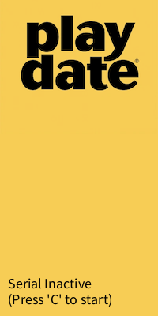
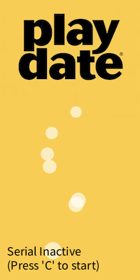
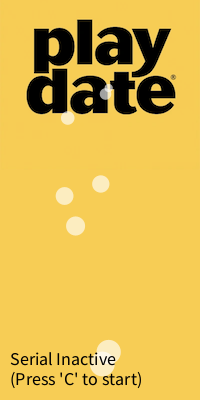
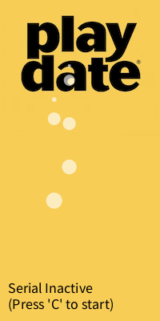

# Playdate Midi Bus



Midi to Playdate comms using a computer running Processing as an intermediary: press keyboard note  > computer midi > Processing Midi lib > Processing serial out > `mn(noteNumber)` received by Playdate.

* Setup your computer midi environment.
* Install [Processing](processing.org/).
* Install [The Midi Bus](https://github.com/micycle1/themidibus/) using the Processing Library Manager.
* If you encounter errors replace the midibus .jar at /Users/user/Documents/Processing/libraries/themidibus/library with the [latest download](https://github.com/micycle1/themidibus/releases/tag/p4).
* Connect Playdate via USB (close the Playdate simulator if running for any reason, it occupies the serial interface of the connected Playdate). 
* Run the sketch, note the address of your Playdate serial interface and update line 10. Rerun.
* Check the available midi in devices and update line 38 with the correct index. Rerun.

If all setup correctly the running Playdate app will receive calls to a `mn(midiNote)` method in its `main.lua`, to add midi note support that's all you need to implement:

```lua
function mn(midiNote)
	print("Received midi note: " .. midiNote)
	...
end

function playdate.update()	
	...
end
```

If you encounter problems you may need to restart your Playdate to try again.